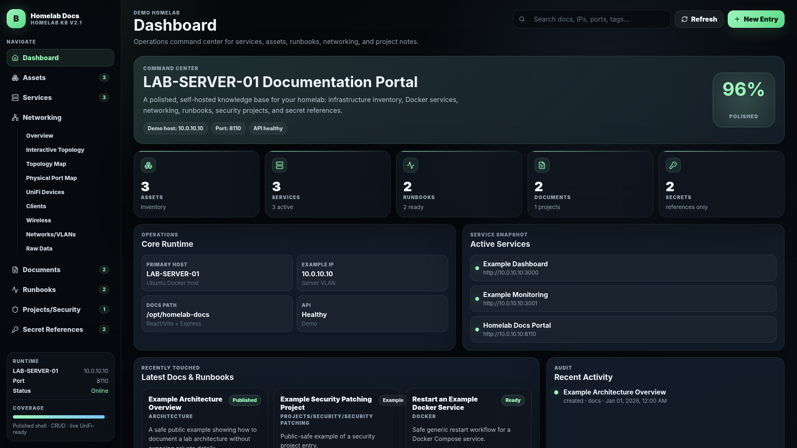
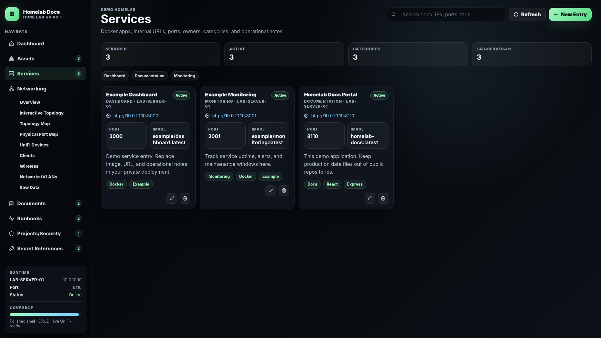
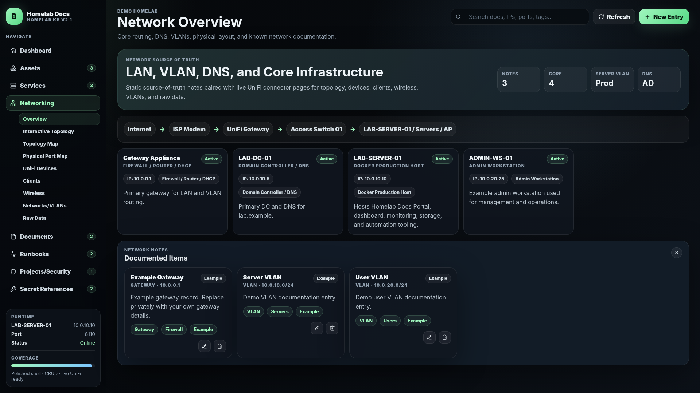
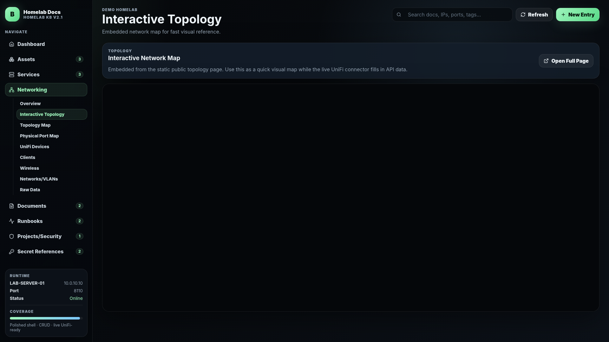
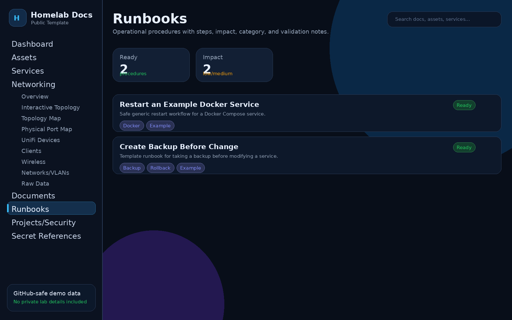
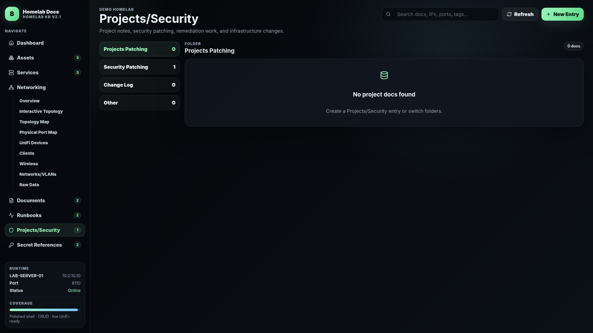

# Homelab Glue README.md

A public-safe React + Express homelab documentation portal template for tracking assets, services, runbooks, network notes, project/security work, and secret references.


## Features

- Dark-mode React/Vite frontend
- Express backend with JSON-file storage
- CRUD flows for assets, services, documents, runbooks, networking, project/security notes, and secret references
- Optional network-controller connector placeholders
- File upload support for private deployments
- Demo topology and demo inventory
- Docker Compose deployment
- SQLite storage with automatic JSON migration and revision history
- Optional local authentication with admin and read-only roles
- Service health checks, latency history, and TLS expiration tracking
- Maintenance scheduling, portable backup/restore, and webhook notifications
- Relationship fields and connector sync previews for common homelab platforms

## Public-safety notice

Do **not** commit production data into this repository. Keep the following out of Git:

- `.env` files
- real IP addresses, domains, hostnames, usernames, client names, and screenshots
- runbooks that reveal your real infrastructure or security process
- API tokens, passwords, SSH keys, cert private keys, tunnel credentials, backup archives, exports, uploads, and database dumps
- `backend/data/backups/` and `backend/uploads/`

The included `.gitignore` is intentionally strict, but you should still manually review before pushing.

## Quick start

```bash
cp .env.example .env

docker compose up -d --build
```

Open:

```text
http://localhost:8110
```

Health check:

```bash
curl http://localhost:8110/api/health
```

## Local development

Backend:

```bash
cd backend
npm install
npm run dev
```

Frontend:

```bash
cd frontend
npm install
npm run dev
```

By default, the frontend dev server expects the backend API at the same origin when built for production. For development, use your own proxy or run the production container.

## Data model

The demo seed file lives at:

```text
backend/data/data.json
```

Collections:

- `assets`
- `services`
- `docs`
- `runbooks`
- `secrets`
- `networking`
- `activity`
- `projects`
- `projectsSecurity`
- `maintenance`
- `connectors`

## Homelab Glue 3 operations

The legacy `backend/data/data.json` file is imported automatically on first start. Live data is then stored in `backend/data/homelab-glue.sqlite`. Keep both the database and `backend/data/backups/` private.

Enable local authentication in `.env`:

```env
AUTH_MODE=basic
ADMIN_USERNAME=admin
ADMIN_PASSWORD=use-a-long-unique-password
VIEWER_USERNAME=viewer
VIEWER_PASSWORD=another-long-unique-password
```

The optional `API_KEY` supports automation through the `X-API-Key` header. Configure `NOTIFICATION_WEBHOOK_URL` for service status-change messages. Operations pages provide manual health checks, maintenance tracking, JSON exports, safety backups before restore, connector previews, and audit history.

## Secret references

The `secrets` collection is for **references only**. Store where a secret lives, rotation cadence, and ownership. Never store raw secret values.

Good example:

```text
Password manager item: Example / DNS Provider / API Token
```

Bad example:

```text
actual-token-value-goes-here
```

## Optional network controller connector

The app includes optional connector routes configured by environment variables:

```env
UNIFI_ENABLED=false
UNIFI_HOST=https://10.0.0.1
UNIFI_USERNAME=
UNIFI_PASSWORD=
UNIFI_SITE=default
UNIFI_INSECURE_TLS=true
```


<!-- FEATURE_SCREENSHOTS_START -->

## Feature Preview

A few highlights from the Homelab Docs Portal interface.

### Dashboard Overview

Centralized landing page for homelab status, inventory summaries, recent activity, and quick navigation.



---

### Services Inventory

Track self-hosted apps, ports, URLs, owners, status, and operational notes in one clean service catalog.



---

### Networking Overview

Document VLANs, network zones, topology notes, routing structure, and infrastructure relationships.



---

### Interactive Topology

Visualize lab relationships between gateways, switches, servers, endpoints, and service layers.



---

### Runbooks

Store repeatable operational procedures for backups, patching, recovery, incident response, and maintenance.



---

### Projects & Security

Track security projects, hardening tasks, audits, lifecycle work, and remediation progress.



---

For the full screenshot gallery, see:

[`docs/homelab-docs-screenshots/README_SCREENSHOTS.md`](docs/homelab-docs-screenshots/README_SCREENSHOTS.md)

<!-- FEATURE_SCREENSHOTS_END -->

## License

