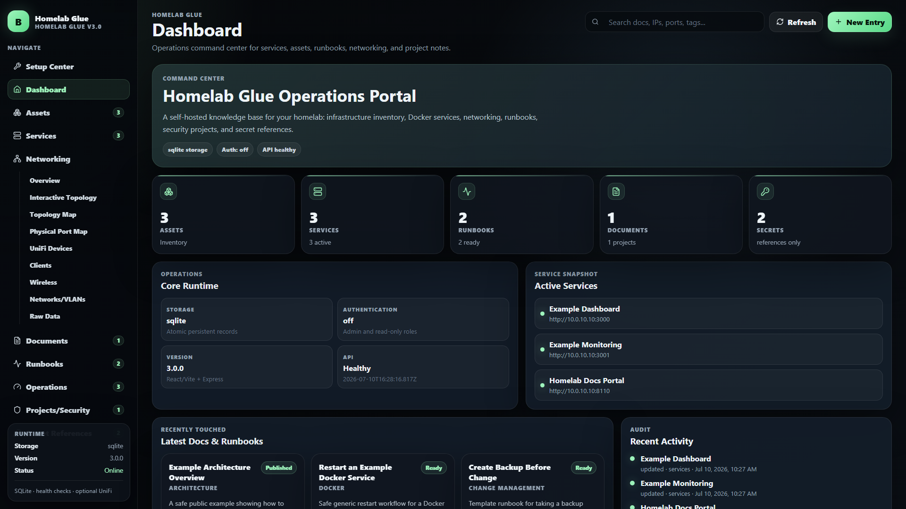
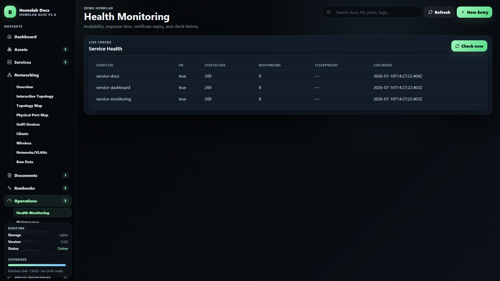
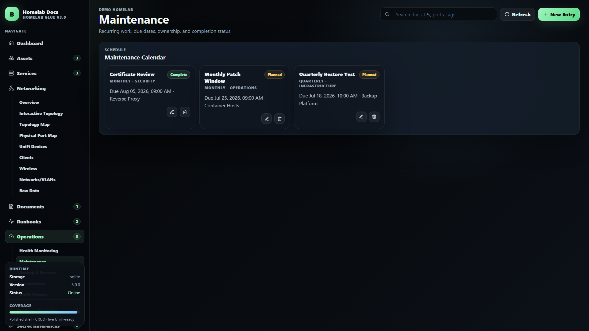
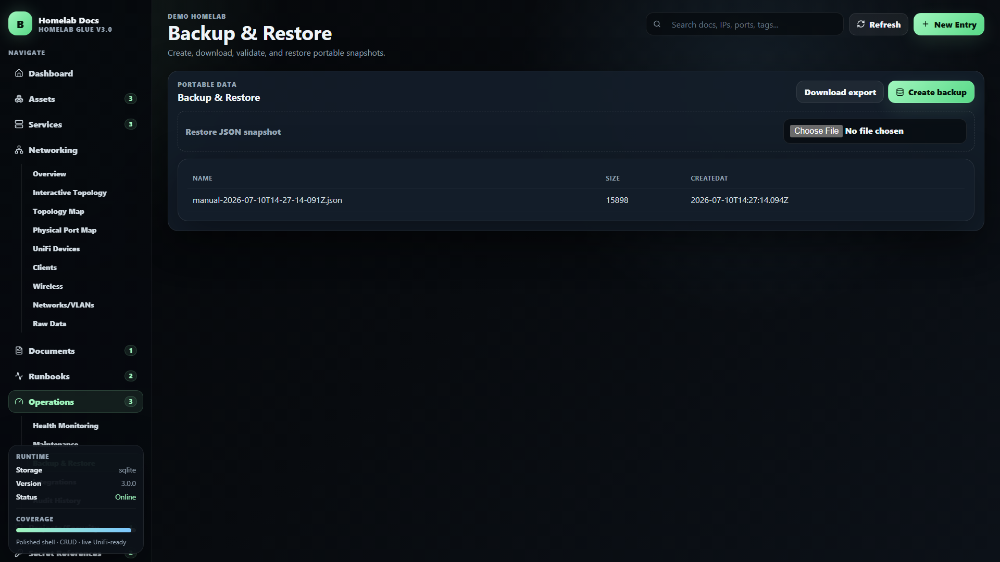
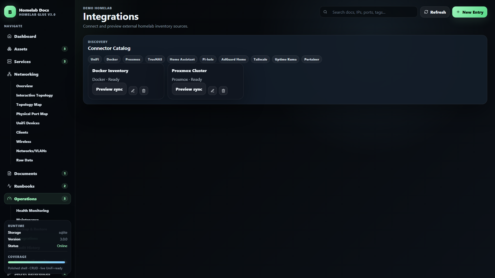
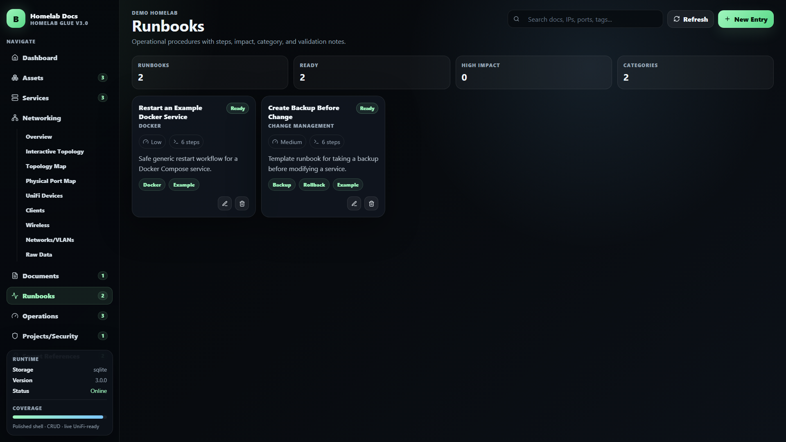

# Homelab Glue

A self-hosted operations and documentation portal for keeping a homelab understandable, maintainable, and recoverable. Homelab Glue combines inventory, service health, runbooks, maintenance, networking, backups, integrations, and security references in one public-safe React + Express application.




## What's new in 3.0

Homelab Glue 3.0 moves beyond a documentation-only portal and adds an operations layer:

- **SQLite persistence:** atomic writes, indexed records, automatic migration from the legacy JSON seed, and per-record revision history.
- **Service monitoring:** manual and scheduled availability checks, HTTP status, response time, TLS certificate expiration, and bounded history.
- **Maintenance planning:** recurring operational work, due dates, ownership, completion state, and overdue visibility.
- **Backup and restore:** portable JSON exports, retained safety backups, validated restore workflows, and automatic pre-import snapshots.
- **Authentication and roles:** optional local Basic authentication, administrator and read-only accounts, plus API-key access for automation.
- **Auditability:** actor-aware activity records, revision inspection, and restoration of earlier record versions.
- **Improved runbooks:** executable checklists, validation and rollback guidance, linked infrastructure, and execution records.
- **Connected records:** relationships between services, assets, runbooks, projects, and secret references.
- **Integration framework:** UniFi support plus safe discovery previews for Docker, Proxmox, TrueNAS, Home Assistant, Pi-hole, AdGuard Home, Tailscale, Uptime Kuma, and Portainer.
- **Notifications:** optional webhook messages when monitored services change state.
- **Security hardening:** rate limiting, configurable CORS, role-protected mutations, safer file uploads, randomized filenames, and non-inline attachment delivery.
- **Reproducible deployment:** Docker Compose, locked frontend/backend dependencies, health endpoints, and an automated SQLite storage test.
- **First-run Setup Center:** a six-step readiness assistant that validates storage, separates host/container ports, generates `.env` and Compose files, configures security and operations, and tests optional UniFi access without retaining credentials.

The original inventory and knowledge-base features remain available for assets, services, documents, networking, projects/security, runbooks, uploads, and secret references.

## Public-safety notice

Do **not** commit production data into this repository. Keep the following out of Git:

- `.env` files
- real IP addresses, domains, hostnames, usernames, client names, and screenshots
- runbooks that reveal your real infrastructure or security process
- API tokens, passwords, SSH keys, cert private keys, tunnel credentials, backup archives, exports, uploads, and database dumps
- `backend/data/backups/` and `backend/uploads/`

The included `.gitignore` is intentionally strict, but you should still manually review before pushing.

## Quick start

New to Docker or self-hosting? Follow the complete beginner walkthrough in **[SETUP.md](SETUP.md)**.

```bash
cp .env.example .env

docker compose up -d --build
```

Open:

```text
http://localhost:8110
```

Health check:

```bash
curl http://localhost:8110/api/health
```

On a new database, Homelab Glue opens the **Setup Center** automatically. The assistant walks through:

1. Host and storage readiness
2. Host-to-container port mapping and allowed browser origins
3. Administrator, read-only, and automation credentials
4. Monitoring, uploads, backups, retention, and notification webhooks
5. Optional UniFi connectivity testing
6. Downloading a generated `.env` and `docker-compose.generated.yml`

UniFi is never required. Credentials entered for its connection test are used only for that request and are not stored by the wizard. Generated environment files contain secrets and must never be committed.

The generated Compose file includes a container health check, persistent data and upload mounts, restart policy, and init process. Homelab Glue also handles container shutdown signals so SQLite is closed cleanly during updates and restarts.

## Local development

Backend:

```bash
cd backend
npm install
npm run dev
```

Frontend:

```bash
cd frontend
npm install
npm run dev
```

By default, the frontend dev server expects the backend API at the same origin when built for production. For development, use your own proxy or run the production container.

## Data model

The demo seed file lives at:

```text
backend/data/data.json
```

Collections:

- `assets`
- `services`
- `docs`
- `runbooks`
- `secrets`
- `networking`
- `activity`
- `projects`
- `projectsSecurity`
- `maintenance`
- `connectors`
- `runbookExecutions`

## Homelab Glue 3 operations

The legacy `backend/data/data.json` file is imported automatically on first start. Live data is then stored in `backend/data/homelab-glue.sqlite`. Keep both the database and `backend/data/backups/` private.

Enable local authentication in `.env`:

```env
AUTH_MODE=basic
ADMIN_USERNAME=admin
ADMIN_PASSWORD=use-a-long-unique-password
VIEWER_USERNAME=viewer
VIEWER_PASSWORD=another-long-unique-password
```

The optional `API_KEY` supports automation through the `X-API-Key` header. Configure `NOTIFICATION_WEBHOOK_URL` for service status-change messages. Operations pages provide manual health checks, maintenance tracking, JSON exports, safety backups before restore, connector previews, and audit history.

For a first deployment, leave `MONITORING_ENABLED=false` until the demo service URLs have been replaced with endpoints from your own environment.

## Secret references

The `secrets` collection is for **references only**. Store where a secret lives, rotation cadence, and ownership. Never store raw secret values.

Good example:

```text
Password manager item: Example / DNS Provider / API Token
```

Bad example:

```text
actual-token-value-goes-here
```

## Optional network controller connector

The app includes optional connector routes configured by environment variables:

```env
UNIFI_ENABLED=false
UNIFI_HOST=https://10.0.0.1
UNIFI_USERNAME=
UNIFI_PASSWORD=
UNIFI_SITE=default
UNIFI_INSECURE_TLS=true
```


<!-- FEATURE_SCREENSHOTS_START -->

## Homelab Glue 3.0 preview

All screenshots below are browser captures from the public-safe demo dataset. They contain no production infrastructure or credentials.

### Health monitoring

Check documented services on demand or on a schedule. Track availability, HTTP responses, latency, certificate expiration, and status transitions from the operations workspace.



### Maintenance calendar

Keep patch windows, restore tests, certificate reviews, secret rotations, and other recurring work visible with owners and due dates.



### Portable backup and restore

Create retained snapshots, download a full JSON export, and restore a validated snapshot. Homelab Glue creates a safety backup before replacing current data.



### Integration catalog

Configure external inventory sources and preview discovery results before allowing imported data to change the documented source of truth.



### Structured runbooks

Document repeatable procedures with impact, tags, validation, rollback guidance, linked records, executable checklists, and execution history.



The earlier inventory, networking, topology, document, security-project, and secret-reference captures remain available in the full gallery.

For the full screenshot gallery, see:

[`docs/homelab-docs-screenshots/README_SCREENSHOTS.md`](docs/homelab-docs-screenshots/README_SCREENSHOTS.md)

<!-- FEATURE_SCREENSHOTS_END -->

## License

